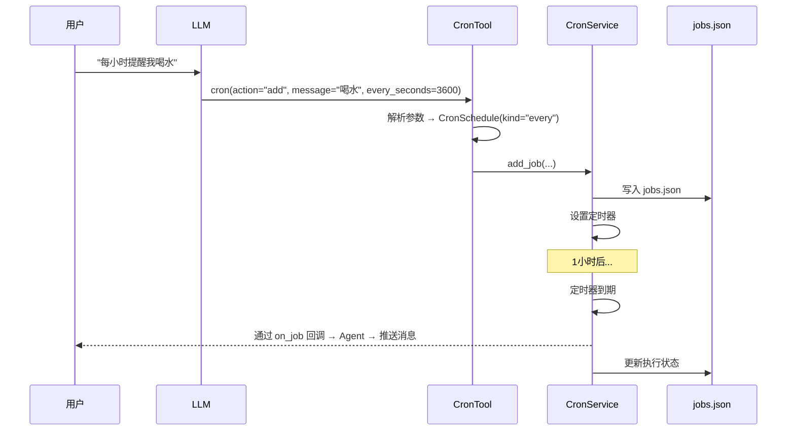

# Cron 定时调度系统

> 学习笔记 · 这是一个很好的"三层架构"案例

---

## 一句话说明

用户说"每小时提醒我喝水" → LLM 理解意图 → 调用 cron 工具 → 底层定时器到点触发 → Agent 发消息给用户。

---

## 三层架构

```
用户自然语言
    ↓
┌──────────────────────────────────────┐
│  Prompt 层 — skills/cron/SKILL.md     │  给 LLM 看的说明书
│  "告诉 LLM 怎么用 cron 工具"            │
└──────────────────────┬───────────────┘
                       ↓
┌──────────────────────────────────────┐
│  工具层 — agent/tools/cron.py         │  Agent 和调度服务的桥梁
│  "解析参数 + 绑定会话上下文"             │
└──────────────────────┬───────────────┘
                       ↓
┌──────────────────────────────────────┐
│  服务层 — cron/service.py             │  真正的调度引擎
│  "持久化 + 定时触发 + 回调执行"          │
└──────────────────────────────────────┘
```

> 这种分层思想在 Agent 系统中非常常见：**Prompt 教 LLM 怎么说，Tool 负责翻译，Service 负责干活**。

---

## 数据流图



---

## 三种定时模式

| 模式 | 参数 | 例子 | 执行后 |
|------|------|------|-------|
| **固定间隔** | `every_seconds` | 每3600秒 = 每小时 | 继续循环 |
| **Cron 表达式** | `cron_expr` + `tz` | `"0 9 * * *"` = 每天早9点 | 继续循环 |
| **一次性** | `at` (ISO 8601时间) | `"2024-06-01T10:00:00"` | 自动删除 |

---

## 调度引擎的核心设计

### 单一定时器原则

CronService **始终只有一个活跃的 asyncio.Task**。每次状态变化（增删改任务）都会：取消旧定时器 → 重新计算下一个最近的任务时间 → 设置新定时器。

```
add_job() → _arm_timer() → asyncio.sleep(到最近任务的时间差)
                              ↓ 到期
                          _on_timer()
                           ├─ 执行到期任务
                           ├─ 保存状态
                           └─ _arm_timer() ← 重新设置
```

### 持久化 + 外部修改感知

任务存在 `jobs.json` 文件里。每次定时器触发时，会检查文件的修改时间（mtime），如果被外部改过就重新加载。这样运维可以直接手动改配置文件。

### 防递归保护

如果 cron 回调触发了 Agent，Agent 又想创建新的 cron 任务，就会无限递归。所以用 `ContextVar` 做了保护：

```python
_in_cron_context: ContextVar[bool]  # 协程安全

# cron 回调中：
token = _in_cron_context.set(True)
# execute() 中检查：
if _in_cron_context.get():
    return "不能在 cron 回调中创建新任务"
```

> `ContextVar` 是 Python 标准库提供的协程安全变量，每个 asyncio.Task 有独立副本，互不干扰。

---

## 值得学习的设计亮点

| 亮点 | 说明 |
|------|------|
| **三层分离** | Prompt / Tool / Service 各司其职，互不耦合 |
| **on_job 回调解耦** | 调度引擎完全不知道 Agent 的存在，通过回调委托业务逻辑 |
| **ContextVar 防递归** | 协程安全，不影响其他并发任务 |
| **mtime 热重载** | 无需重启即可更新任务配置 |
| **单一定时器** | 简单可靠，避免多定时器的管理复杂度 |

---

> 详细学习笔记索引：[01-overview.md](./01-overview.md) | [02-agent-loop.md](./02-agent-loop.md) | [03-tool-system.md](./03-tool-system.md) | [04-memory.md](./04-memory.md) | [05-multi-agent.md](./05-multi-agent.md) | [06-interview.md](./06-interview.md)
